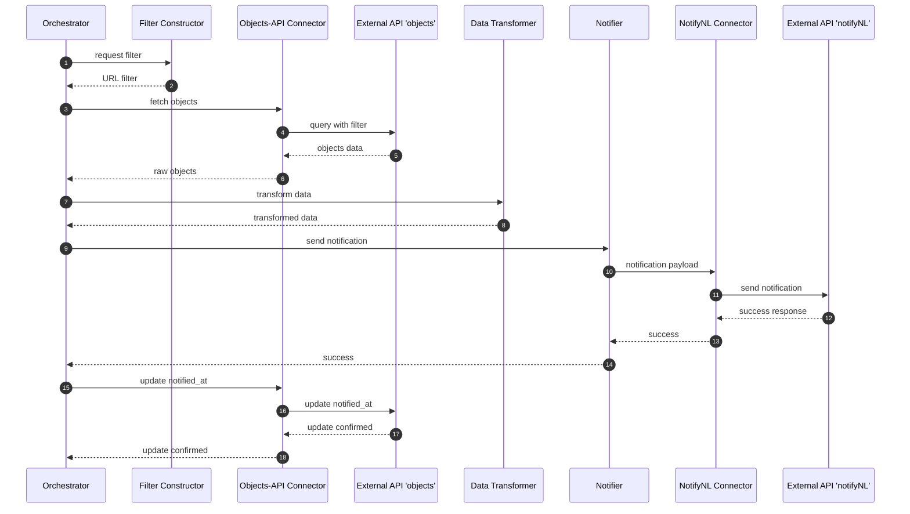

# Object notifications for Open objecten

This module allows for sending notifications/messages based on specific criteria.
It is able to:
- Connect to 'Open objecten'
- Retrieve a list of objects based on specific criteria
- Connect to NotifyNL
- Send notifications using specific fields from the object (for email, sms) and
  personalisation.

## Configuration
When called, the module will use the provided configuration to retrieve one or 
more lists of objects and send notifications based on the provided criteria.

Example configuration (json):
```json
[{
  'objectType': '<someuuid>',
  'filters': [
    {
      'path': 'some.object.path',
      'operator': 'lte',
      'value': 'somevalue'
    }
  ]
}]
```

### Special values: 
For the value key, you can use {{today}} as a value to use today's date. 

Example usage:

```
import { Notifier } from '@gemeentenijmegen/object-notifier';

const result = await Notifier.notify(config, dryrun: boolean);
// result = { succesful: 10, failed: 2 }

```

### Sequence flow
This flow describes the happy path. Especially in the two external connections, error handling needs to be added. Most naïvely, this is called regularly (daily) so
many errors may resolve automatically. Some type of retry mechanism is probably required.


